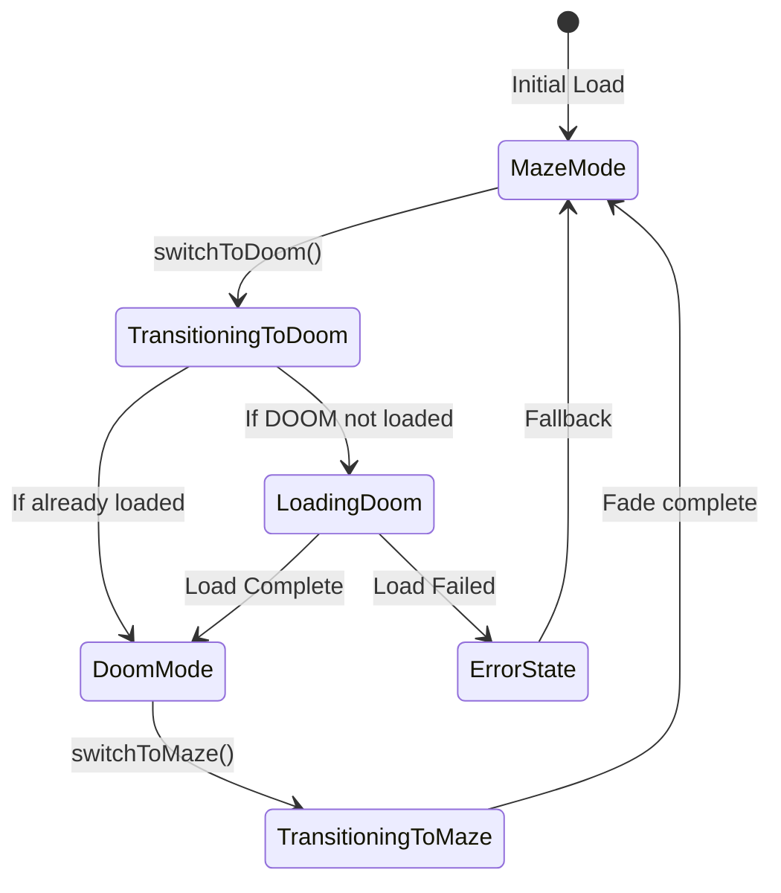

# 01 Architecture, Input & Audio Management

## 1. Canvas Swapping Architecture & API Design

### Canvas Layering Strategy
Both the Three.js canvas (Maze) and the jsZDoom canvas (DOOM) will coexist in the DOM to avoid the overhead of complete re-initialization. They will be managed via CSS `z-index` and `opacity` to handle mode switching and fade transitions seamlessly. 

**HTML/CSS Mockup (ASCII):**
```html
<div id="game-container" style="position: relative; width: 100%; height: 100vh;">
  <!-- Maze Canvas: Base layer -->
  <canvas id="maze-canvas" style="position: absolute; z-index: 10;"></canvas>
  
  <!-- DOOM Canvas: Top layer, hidden by default -->
  <!-- opacity fades from 0 to 1 during transition -->
  <canvas id="doom-canvas" style="position: absolute; z-index: 20; opacity: 0; pointer-events: none;"></canvas>
  
  <!-- UI Overlays (Win95, Admin, HUD) -->
  <div id="ui-layer" style="position: absolute; z-index: 30; pointer-events: none;"></div>
</div>
```

### GameModeManager API (TypeScript Interface)
```typescript
/**
 * Manages transitions between the Maze (Three.js) and DOOM (jsZDoom) engines.
 */
interface IGameModeManager {
  /** Current active mode */
  currentMode: 'maze' | 'doom' | 'transitioning';
  
  /**
   * Initializes both engines or prepares them for switching.
   */
  init(mazeEngine: any, doomLoader: any): Promise<void>;
  
  /**
   * Switches from DOOM back to the Maze mode.
   * - Pauses DOOM game loop/audio
   * - Fades out DOOM canvas, fades in Maze canvas
   * - Resumes Maze render loop and audio context
   * - Restores pointer lock for Maze
   */
  switchToMaze(): Promise<void>;
  
  /**
   * Switches from Maze to DOOM mode.
   * - Saves Maze player position
   * - Pauses Maze render loop/audio
   * - Triggers DOOM lazy-load if not already loaded
   * - Fades in DOOM canvas
   * - Requests pointer lock for DOOM
   * @param startPosition Position to seed DOOM spawn point
   */
  switchToDoom(startPosition: { x: number, z: number }): Promise<void>;
  
  /** Get current mode */
  getCurrentMode(): 'maze' | 'doom' | 'transitioning';
  
  /** Register event listener for mode changes */
  onModeChange(callback: (newMode: string) => void): void;
  
  /** Clean up resources */
  dispose(): void;
}
```

### State Machine Diagram


---

## 2. Input Routing Layer Design

To prevent event listener conflicts and double-firing inputs, a single `InputRouter` will sit at the global level and delegate events strictly to the active engine.

### Input Flow Diagram
```
[DOM Events: keydown/keyup/mousemove/mousedown]
       │
       ▼
[ InputRouter (Global Listener) ]
       │
       ├─► (if Mode == 'transitioning') ─► [Ignore/Block Input]
       │
       ├─► (if Mode == 'maze') ──► [FirstPersonControls (Three.js)]
       │
       └─► (if Mode == 'doom') ──► [jsZDoom Input Handler]
```

### InputRouter Class Skeleton
```javascript
class InputRouter {
  constructor(modeManager, mazeControls, doomControls) {
    this.modeManager = modeManager;
    this.mazeControls = mazeControls;
    this.doomControls = doomControls;
    
    this._handleKeyDown = this._handleKeyDown.bind(this);
    this._handleMouseMove = this._handleMouseMove.bind(this);
    // ... bind other events
  }
  
  attach() {
    document.addEventListener('keydown', this._handleKeyDown);
    document.addEventListener('mousemove', this._handleMouseMove);
    // ...
  }
  
  detach() {
    document.removeEventListener('keydown', this._handleKeyDown);
    document.removeEventListener('mousemove', this._handleMouseMove);
  }
  
  _handleKeyDown(event) {
    const mode = this.modeManager.getCurrentMode();
    if (mode === 'transitioning') return;
    
    if (event.key === 'Escape') {
      // Handle pointer-lock exit globally or open global menu
      return;
    }
    
    if (mode === 'maze') {
      this.mazeControls.onKeyDown(event);
    } else if (mode === 'doom') {
      this.doomControls.onKeyDown(event);
    }
  }
  
  // Similar logic for mouse move, handling pointer lock requests uniquely
}
```

### Pointer-lock Conflict Resolution
When switching modes:
1. `document.exitPointerLock()` is called.
2. The `InputRouter` suppresses lock requests during `'transitioning'`.
3. Once transition completes, the user must click the canvas (standard browser security requirement). 
4. The router sends the lock request to the newly active canvas (`maze-canvas` or `doom-canvas`).

### Keyboard Event Mapping
| Key | Maze Mode Action | DOOM Mode Action | Global Override |
|-----|------------------|------------------|-----------------|
| WASD / Arrows | Move player | Move Doomguy | - |
| Mouse Move | Look around (Three.js) | Look around (DOOM) | - |
| Left Click | (None) | Shoot / Attack | Request Pointer Lock |
| TAB | Open Minimap | Toggle Automap | - |
| ESC | Exit pointer lock | Exit pointer lock / Menu | Exits lock globally |
| Settings (⚙) | Open Admin Panel | Open Admin Panel | Pauses active engine |

---

## 3. Audio Context Management Strategy

### Shared vs Separate AudioContext
**Decision: Shared AudioContext**
- **Rationale:** Browsers impose strict limits and autoplay policies on `AudioContext`. Juggling two separate contexts can lead to one being suspended arbitrarily by the browser, causing missing sound when switching modes. A single shared `AudioContext` with separate `GainNodes` (mixers) for Maze and DOOM is the most robust approach.

### Audio Architecture Diagram
```
[Global AudioContext]
       │
       ├─► [Maze GainNode (Master)] ─► [Three.js PositionalAudio / Ambience]
       │
       └─► [DOOM GainNode (Master)] ─► [jsZDoom WebAudio Output]
```

### AudioManager Code Template
```javascript
class AudioManager {
  constructor() {
    this.context = new (window.AudioContext || window.webkitAudioContext)();
    
    // Create master mixers
    this.mazeMixer = this.context.createGain();
    this.doomMixer = this.context.createGain();
    
    this.mazeMixer.connect(this.context.destination);
    this.doomMixer.connect(this.context.destination);
    
    // Default state: Maze active, DOOM muted
    this.doomMixer.gain.value = 0;
  }
  
  async resumeContext() {
    if (this.context.state === 'suspended') {
      await this.context.resume();
    }
  }
  
  crossfade(fromMode, toMode, duration = 0.5) {
    const now = this.context.currentTime;
    
    if (fromMode === 'maze' && toMode === 'doom') {
      this.mazeMixer.gain.linearRampToValueAtTime(0, now + duration);
      this.doomMixer.gain.linearRampToValueAtTime(1, now + duration);
    } else {
      this.doomMixer.gain.linearRampToValueAtTime(0, now + duration);
      this.mazeMixer.gain.linearRampToValueAtTime(1, now + duration);
    }
  }
}
```

### Compatibility & Latency Notes
- Safari still requires `webkitAudioContext`.
- DOOM audio might lag on initial WebAssembly load. To mitigate, we will trigger a short silent oscillator immediately upon `resumeContext()` to keep the audio thread active during WASM loading.
